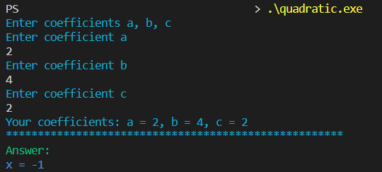

# Quadratic equations solver

Solves quadratic equations `ax^2 + bx + с = 0` and prints roots of a equation and their number.

## Table of contents

- [Setup](#setup)
    - [For Windows](#for-windows)
- [Usage](#usage)
    - [Usage example](#usage-example)
- [Tests](#tests)
    - [Auto-test mode](#auto-test-mode)
    - [Tests from file](#tests-from-file)
    - [How to make file for tests](#how-to-make-file-for-tests)
    - [Example](#example)
  
## Setup

### For Windows

1. Run `git clone https://github.com/Krasnolutskaia/quadratisch-praktisch-gut.git --depth 1`
2. Go into the cloned folder with `cd quadratisch-praktisch-gut`
3. Run `.\compile.bat`
4. Run `.\quadratic.exe`

## Usage

After running `.\quadratic.exe` enter equation coefficients one by one and get your answer.
For help run `.\quadratic.exe --help`

### Usage example



## Tests

### Auto-test mode

Run `.\quadratic.exe --auto-test` to start built-in tests. The program will print number of successful tests. If received information and reference datas don't match, test data will be printed.

### Tests from file

Run `.\quadratic.exe --test [file_name]` to start tests from your file. The program will print number of successful tests. If received information and reference datas don't match, test data will be printed.

### How to make file for tests 

1. Write a number of tests on the first line
2. Use one string for one test, following this template:
   `[coeff a] [coeff b] [coeff c] [x1] [x2] [number of roots]`
   If the equation has no roots, write `0` instead of [number of roots]. If the equation has infinite number of roots, write `3` instead of [number of roots] and `0 0` instead of `[x1] [x2]`.
   If the equation has one root, write same values instead of `[x1]` and `[x2]`.
   
### Example:

test.txt
```
2
0 0 0 0 0 3
1 -3 2 1 2 2
```
